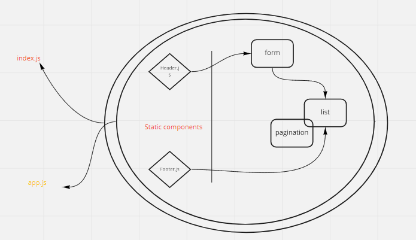

# todo-app

## [Pull Requests](https://github.com/MohammadAltamimi98/todo-app/pulls)
## [live site on netlify](https://todolist-mohammad.netlify.app/)
<!-- ## [sandbox](https://codesandbox.io/s/todo-3cfhd) -->

 
 

## How to start this app ?

1. clone this repository
2. install all dependencies and pacakges 
   `npm install`
3. run the app
  `npm start`
 
 

  

 
 

## Notes:

  - useForm hooks is used to handle the form submission and the input values changes.
  - context api is used in this app tp handle the flow of elements in the list and their show/ hide attributes.